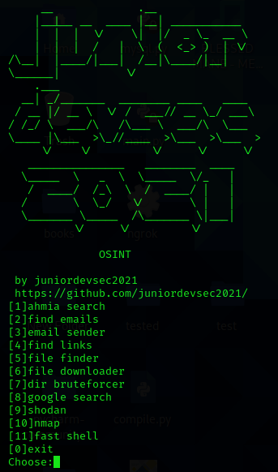

# osint tool + bonus options
osint tool 
### Osint tool for educational purposes only(ethical hacking).
* SETUP:
* OS: linux/ubuntu distros
* python modules: pip install -r requirements
* run the program with the command python3 junior_osint.py

# about the options: 
*
* [1]ahmia search (search in ahmia.fi)
* [2]find emails (scrape emails with in .onion or clearnet sites)
* [3]email sender (send single or mass emails)
* [4]find links (find links in a domain)
* [5]file finder (find files in a domain[type extension])
* [6]file downloader (download files from a domain[paste the domain + founded file name])
* [7]dir bruteforcer (bruteforce .onion or clearnet sites over tor)
* [8]google search (search in google)
* [9]shodan (python shodan,better than the built in Kali Linux)
* [10]nmap (python nmap with separated functions)
* [11]fast shell (create fast ngrok server,netcat listener and shell(python,bash,php)
* [12]keylogger (creates python keylogger)

### The program is not finished yet,soon there will be new features.

